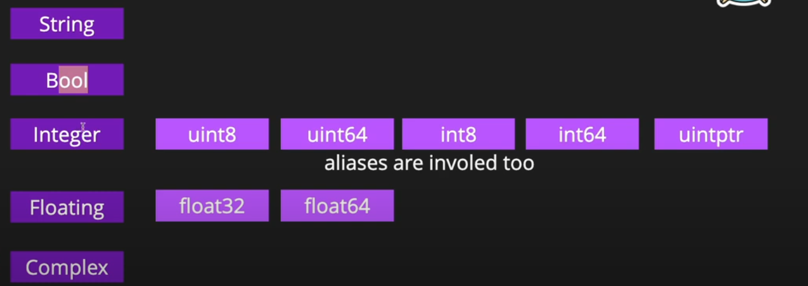

> crtl+ l to delete the terminal
# starting
1. in your folder where you write file:

> go mod init hello

to run 
> go run hello.go

DOCS
>go help

env file dir
>go env GOPATH

# lexer
 lexers are important for processing source code and preparing it for the parser, which checks the syntax of the program

- suppose we didnt put ; at the print the lexer will put it

# type
- fmt.Println see P is capital means it was exported publicably
- everything is type

# int
- int - signed integer
- uint - unsigned integer

# place to find package for go
> https://pkg.go.dev/

# printf and println
- printf: It allows you to format the output string using format specifiers like %T, %d, %s, etc.

# build window exe
- in your git bash
- GOOS="windows" go build

# struct
- we dont have classes in golang / only struct
- no inheritance/super/parent